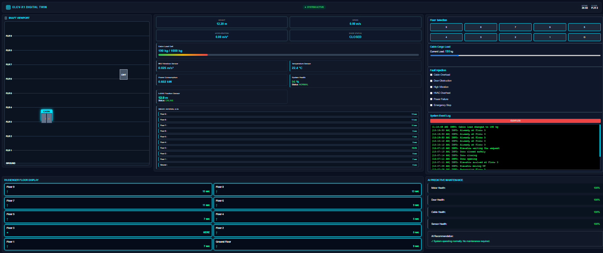
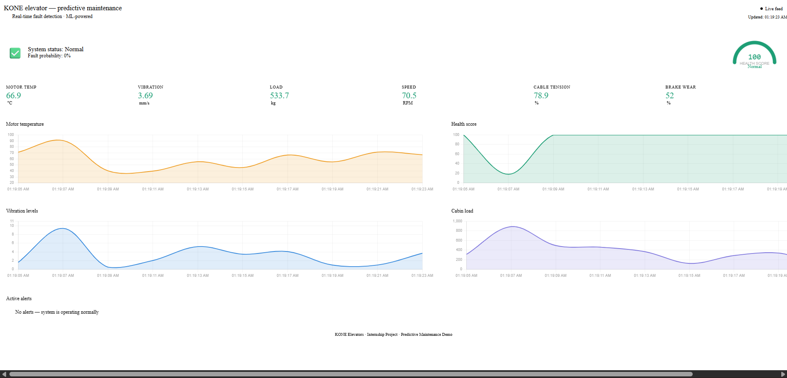

# 🚀 Smart Elevator Health Monitoring & Position Tracking System with AI-Based Predictive Maintenance

## 📌 Project Overview

This project presents an intelligent elevator monitoring system that combines **real-time health monitoring, position tracking, AI-based predictive maintenance, and a digital twin dashboard** to improve elevator safety, reliability, and maintenance efficiency.

The system continuously monitors important elevator parameters such as motor temperature, vibration, cabin load, speed, cable condition, brake wear, and elevator position. The collected data is analyzed using AI algorithms to predict potential failures before they occur.

A real-time **Digital Twin Dashboard** provides a virtual representation of the elevator system, allowing operators to visualize elevator movement, sensor values, fault conditions, and system health.

---

# 🎯 Objectives

* Monitor elevator health parameters in real time
* Track elevator position and movement
* Detect abnormal operating conditions
* Predict possible failures using AI models
* Reduce unexpected breakdowns and maintenance cost
* Provide a digital twin visualization of the elevator system

---

# 🏗️ System Modules

## 1. Health Monitoring Module

Monitors:

* 🌡️ Motor temperature
* 📳 Vibration level
* ⚖️ Cabin load
* 🔌 Power consumption
* 🔗 Cable tension
* 🛑 Brake wear

---

## 2. Position Tracking Module

Provides real-time information about:

* Current floor position
* Elevator movement direction
* Speed and acceleration
* Arrival time estimation (ETA)

---

## 3. AI-Based Predictive Maintenance Module

Uses machine learning techniques to:

* Analyze historical and real-time sensor data
* Detect abnormal patterns
* Calculate elevator health score
* Predict possible failures
* Generate maintenance recommendations

---

## 4. Digital Twin Dashboard

Features:

* 3D/2D virtual elevator representation
* Real-time shaft visualization
* Elevator cabin and counterweight tracking
* Sensor telemetry dashboard
* Floor selection simulation
* Fault injection and event logging
* Passenger floor ETA display
* AI maintenance status monitoring

---

# 🛠️ Technologies Used

### Frontend

* HTML5
* CSS3
* JavaScript

### Data Visualization

* Charts.js
* Real-time dashboards

### AI / Machine Learning

* Python
* Scikit-learn
* Predictive analytics models

### Digital Twin Concepts

* Real-time system simulation
* Virtual elevator monitoring

---

# 📊 Key Features

✅ Real-time elevator monitoring
✅ Position tracking system
✅ Smart arrival time prediction
✅ Fault detection and alerts
✅ AI-based predictive maintenance
✅ Digital Twin dashboard
✅ Health score analysis
✅ Maintenance recommendation engine

# 📂 Project Structure

Smart-Elevator-System/
│
├── Elevator-Digital-Twin/
│   ├── index.html
│   ├── style.css
│   ├── app.js
│
├── AI-Predictive-Maintenance/
│   ├── index.html
│
├── Images/
│   ├── digital-twin-dashboard.png
│   ├── predictive-maintenance-dashboard.png
│
└── README.md

## Images
## Digital Twin Dashboard

## AI Predictive Maintenance Dashboard

## 🌐 Live Demo

- 🏢 Main Project Portal: [Open Website](https://akpravinkumar.github.io/Smart-Elevator-Health-Monitoring-And-Position-Tracking-System-with-AI-Based-Predictive-Maintenance/)
- 🚀 Digital Twin Dashboard
- 🤖 AI Predictive Maintenance Dashboard

# 🔮 Future Enhancements

* IoT sensor integration with real elevators
* Cloud-based data storage
* Mobile monitoring application
* Deep learning-based fault prediction
* Automated maintenance scheduling

---

# 👨‍💻 Developed By
Team E4
- Riyash M
- Pravinkumar A K
- Movika P
- Syed Peer Mohammed N

Electronics and Communication Engineering

